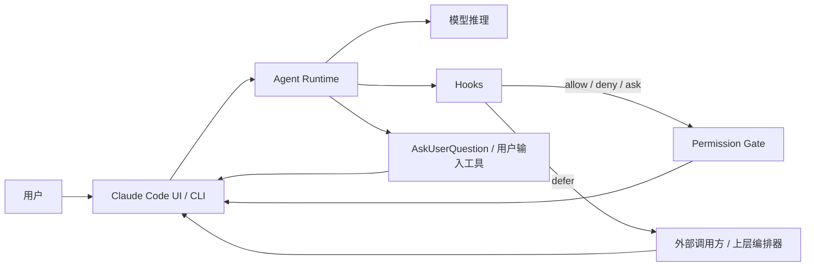
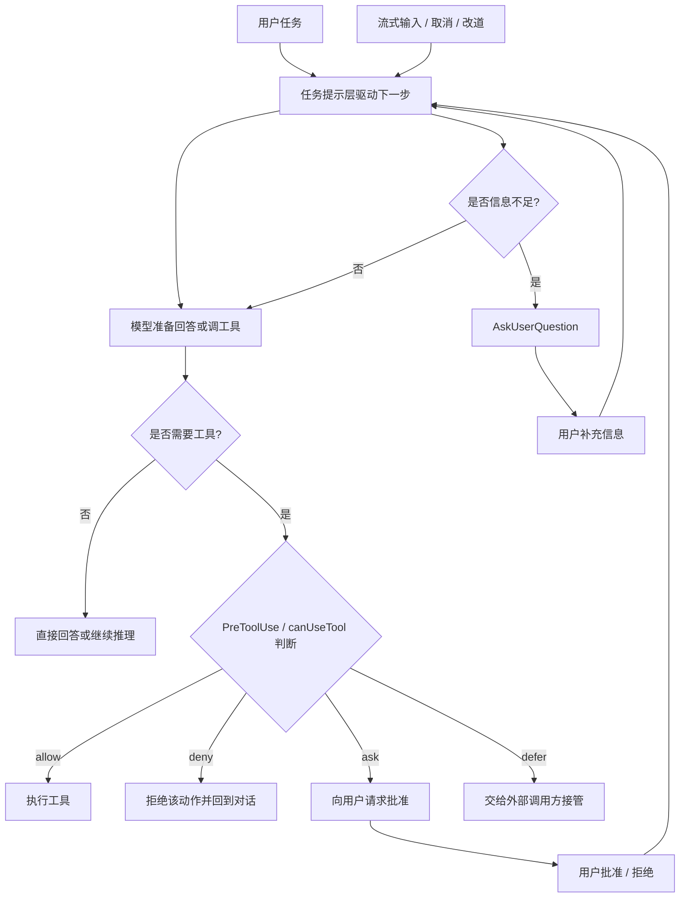

# Claude Code 中断与交互架构图

这份子文档只讲 Claude Code，目标是帮助理解它为什么更像“贴近工具调用点的人机闸门”，而不是把 turn 级控制面完全外显出来。

## 1. 架构图

## 2. 怎么理解这张图

从公开文档看，Claude Code 的“人工介入”主要围绕工具调用和权限流组织：

- `Hooks`
  - 在 `PreToolUse` 一类阶段决定是允许、拒绝还是询问
- `Permission Gate`
  - 承接 `ask` 带来的动作级确认
  - 这里的核心问题是“这个工具调用能不能继续”
- `AskUserQuestion`
  - 负责 agent 主动向用户提问
  - 这里的核心问题是“agent 需要补什么信息”
- `defer`
  - 让外部调用方接住当前待处理动作
  - 这里的核心问题是“上层系统要不要先接管”

所以 Claude Code 的重心更靠近：

- 工具调用前的判断
- 动作发生点附近的人类在环
- 非交互模式下围绕待处理动作的恢复

## 3. 设计思想

Claude Code 这套思路的重点，不是把所有交互抽象成统一状态机，而是尽量贴近“当前动作”来做人机协同：

- 要调用工具前，先过权限闸门
- 需要用户补信息时，直接发问
- 非交互模式卡住时，把待处理动作交给上层编排器

这种方式的优点是：

- 用户更容易理解“为什么现在被问到”
- 工具调用级确认的体验通常更直接
- permission UX 很容易做得清楚

它的边界是：

- 公开形态下更强调动作级接入点
- 不像 Codex 那样把 turn 级控制面单独做得很显式

## 4. 文档角度能看出什么

只看公开文档，Claude Code 最醒目的特征是“人类介入紧贴动作发生点”：

- hooks
  - 直接介入工具调用前的判定
  - 文档重点放在 allow / deny / ask / defer 这种决策语义
- permissions
  - 强调哪些动作需要批准、用户怎么批准、批准能持续多久
  - 文档体验很贴近真实用户操作
- `AskUserQuestion`
  - 把 agent 向用户补信息这件事独立出来
  - 但仍然偏向“当前任务需要什么信息”

从文档组织方式就能感觉到，它的设计重心不是“先抽象统一状态机”，而是：

- 先把权限和动作接点做好
- 再把用户确认和补信息嵌进去

因此，Claude Code 的公开材料往往更容易让人直接联想到：

- 这个工具调用该不该跑
- 现在是不是该问用户一下
- 外部编排器要不要先接管这一动作

## 5. 提示词分层与文案骨架

这里要先说清楚一个边界：

- Claude Code 的完整内部系统提示词并没有像可核对源码那样公开展开

所以这部分必须拆成两类：

- 可由公开文档较稳确认的提示职责
- 基于交互接口和产品行为做的高概率推断

### 5.1 可较稳确认的提示职责

从公开文档可以比较稳地确认，Claude Code 至少围绕下面几类提示职责在工作：

- 任务执行提示
  - 让 agent 继续拆解任务、决定下一步行为
- 工具使用判断提示
  - 让 agent 在尝试调工具前考虑权限与风险
- 澄清提问提示
  - 当信息不足时，通过 `AskUserQuestion` 向用户补问
- 权限确认提示
  - 当 `ask` 或 `canUseTool` 触发时，把动作请求转成人类可判断的确认点
- 恢复继续提示
  - 用户批准、拒绝或补充信息后，继续后续执行

换句话说，虽然看不到完整系统提示词正文，但从公开接口能看出：

- Claude Code 并不是“直接乱试工具”
- 它显然有一层把任务、权限、提问、恢复串起来的提示组织

### 5.2 高概率存在的提示层

下面这些更适合写成“推断”，而不是“已公开证实”：

- 工具前风险判断层
  - 决定该直接调用、先 ask、还是交给 defer
- 提问触发层
  - 决定何时用 `AskUserQuestion` 而不是继续猜
- 恢复层
  - 当用户给出批准或补充信息后，告诉模型如何继续当前任务
- 流式打断层
  - 当外部输入在运行中插入时，告诉模型当前优先级已经变化

这些层之所以可以合理推断，是因为如果没有这些提示职责，公开文档描述的审批、提问、流式改道很难稳定串起来。

### 5.3 适合怎么理解它的文案骨架

如果把 Claude Code 的提示组织抽象成几类人能读懂的文案骨架，大概会更像下面这样。

#### 工具判断提示

它解决的是：

- 这个动作应不应该立刻执行
- 是否需要先 ask
- 是否应该 defer 给外部调用方

骨架更像：

- 先判断当前动作的风险和必要性
- 高风险先请求确认
- 无法当前决策时交给上层接管

#### 澄清提问提示

它解决的是：

- 当前缺的是业务偏好、实现选择，还是必要输入

骨架更像：

- 如果缺少关键前提，不要继续猜
- 先向用户提出少量高价值问题
- 拿到答案后再继续推进

#### 批准恢复提示

它解决的是：

- 用户批准后怎么继续
- 用户拒绝后是放弃、改道还是退回解释

骨架更像：

- 根据批准结果更新当前执行策略
- 如果被拒绝，优先寻找安全替代路径
- 如果拿到补充信息，就把它并入当前任务上下文

### 5.4 这里要特别注意的边界

Claude Code 这部分最容易误判的地方是：

- 你能看到很清楚的 ask / defer / `AskUserQuestion`
- 但看不到完整公开的内部提示词正文

所以更稳妥的写法应该是：

- 提示职责可以较稳归纳
- 提示全文不能假装已知

### 5.5 我们是如何知道这些的

对 Claude Code，这部分判断必须比 Codex 更克制。

主要依据是两类：

- 公开接口证据
  - hooks、permissions、`AskUserQuestion`、外部接管语义已经足以说明它一定存在对应的提示职责
- 产品行为推断
  - 如果没有工具判断提示、澄清提问提示、批准恢复提示，这些公开交互链很难稳定成立

所以对 Claude Code 来说：

- “存在这些提示职责”可以较稳归纳
- “完整内部提示词正文长什么样”不能假装已知
- “每层到底如何拼接”更适合写成推断而不是断言

### 5.6 公开可见的具体文案能说明什么

即使不谈内部系统提示词，Claude 这边也有一批非常关键的公开协议文案，已经足够说明它怎样把交互嵌进动作流。

从官方文档可直接确认这些具体表达：

- hooks 里的 `\"ask\" asks the user to confirm the tool call in the UI`
  - 说明 ask 不是抽象建议，而是明确的 UI 确认动作
- `canUseTool` covers everything else at runtime
  - 说明权限链不是静态规则到此为止，后面还有 runtime 决策回调
- `Both trigger your canUseTool callback, which pauses execution until you return a response`
  - 说明工具审批和 `AskUserQuestion` 都能进入明确的等待态
- streaming input 可用于 `interrupt the agent mid-task`、`add context`、`change direction while Claude is working`
  - 说明运行中改道也是公开交互模型的一部分

这些具体文案已经能支撑一个很重要的判断：

- Claude 的交互不是附带的说明文字
- 而是被正式写进权限协议、用户输入协议和流式输入语义里的

## 6. 源码视角的轻量讲解

这里要先明确：

- 这部分不能当作正式现行源码分析
- 更准确的依据仍然是官方文档，非官方社区材料只适合作为低权重背景信息

在这个边界内，可以把 Claude Code 的实现轮廓简单理解为几层：

- hooks / permission 相关层
  - 负责工具调用前的 allow / deny / ask / defer
  - 设计重心靠近 permission gate
- agent runtime
  - 把模型输出转成工具调用、用户提问与后续动作
  - 但公开材料里更强调交互接点，而不是完整 turn 控制面
- question / approval UI
  - 把 `ask` 和用户问答呈现出来
  - 更像动作级人类在环界面
- 外部调用方接管层
  - 围绕 `defer` 这类机制运作
  - 让上层系统在非交互模式下继续推进

如果只看设计思想，可以把它简化成：

- 先判断工具能不能用
- 需要人时就在动作点停一下
- 需要外部系统时，就把待处理动作交上去

源码视角下，还有一个很重要的反向结论：

- 非官方社区材料不足以支持“从现行源码严格反推运行时边界”
- 它更适合作为辅助理解轮廓的背景材料，而不是正式依据

这反过来说明，理解 Claude Code 的中断与交互，现阶段更应该：

- 先信官方文档
- 再把非官方社区材料当作低权重轮廓材料

换句话说，Claude Code 这部分更适合学“公开设计思想”，不太适合学“现行源码细节布局”。

## 7. 判断如何流转

如果把 Claude Code 的一次典型中断 / 交互流程按判断链看，可以概括成下面这样：

这条流转里最重要的不是某个节点，而是它的判断重心：

- 先围绕动作点判断
- 再围绕信息缺口提问
- 然后围绕批准结果或补充输入继续

所以 Claude Code 的交互给人的感觉通常是：

- 不是先抽象一个大状态机
- 而是围绕“当前动作要不要继续”不断重入判断

### 7.1 从公开协议文案再看这条流

结合公开协议文案，这条流转还能再多看出两点：

- 它的很多判断都贴着动作点发生
  - 因为 hooks、permission rules、`canUseTool` 的检查顺序是公开写出来的
- 它的很多交互都能进入明确等待态
  - 因为官方文档已经明确写出会 pause execution，直到你返回响应

这和本文前面的结论是一致的：

- Claude Code 更像动作点附近的人机闸门
- 它的提示层更像围绕动作判断不断重入，而不是先建一个独立 supervisor 状态机

## 8. 你可以怎么读它

如果你的目标是理解 agent 中断与交互，读 Claude Code 最有效的顺序通常是：

1. 先看 hooks 与 permissions 文档
   - 理解人类介入点为什么贴着工具调用出现
2. 再看用户提问相关能力
   - 理解 agent 缺信息时如何向人补问
3. 最后再看外部接管语义
   - 理解 `defer` 一类机制怎样把待处理动作交给上层

这样读的好处是：

- 你会先看到它最核心的产品思想
- 不会误把非官方社区材料当成正式源码地图

## 9. 对中断与交互的启发

如果你关心的是“怎么把人类介入做得顺手”，Claude Code 这套思路最值得借鉴的是：

- 把确认点贴近具体动作
- 把提问点贴近信息缺口
- 把外部接管点贴近待处理任务

这样做出来的系统，通常更容易获得：

- 清晰的权限感知
- 自然的动作级确认
- 较低的用户理解成本

但如果你要的是“运行中 turn 的显式控制台”，它就不是最典型的那类公开设计。
