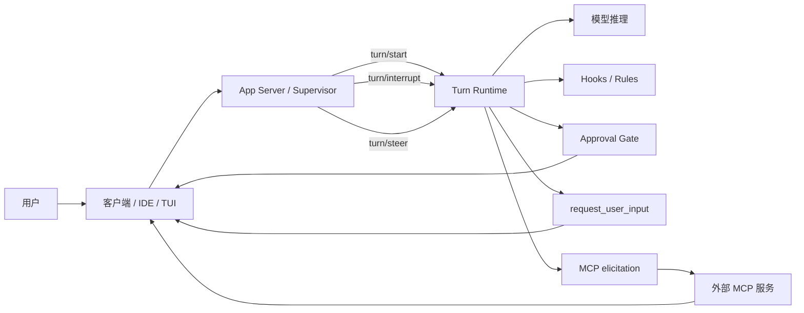
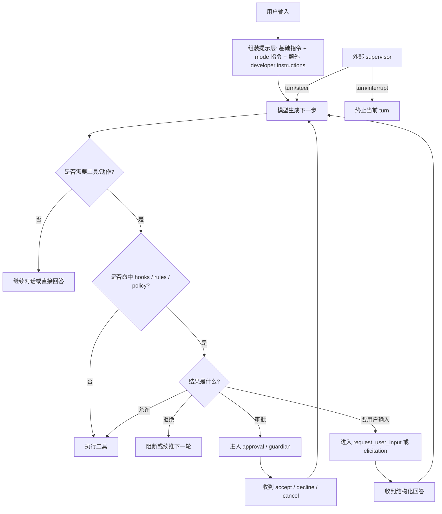

# Codex 中断与交互架构图

这份子文档只讲 Codex，目标是用尽量低风险、低细节的方式说明它为什么更像一个“可被外部 harness 控制”的 agent 运行时。

## 1. 架构图

## 2. 怎么理解这张图

Codex 不是把“中断”和“交互”都塞进 hook 里，而是拆成几条不同的控制链：

- 生成链
  - `Turn Runtime` 驱动一次 turn 的推进、工具调用和状态变化
- 守卫链
  - `Hooks / Rules` 负责拦截、补充上下文、限制动作
  - 这里更像 runtime guardrail
- 审批链
  - `Approval Gate` 负责把危险动作挡在执行前
  - 这里的核心问题是“要不要允许”
- 问答链
  - `request_user_input` 与 `MCP elicitation` 负责真暂停并等待结构化输入
  - 这里的核心问题是“等谁回、回什么”
- 控制链
  - `App Server / Supervisor` 负责 `turn/start`、`turn/interrupt`、`turn/steer`
  - 这里的核心问题是“当前 turn 继续、停止还是改道”

这也是为什么 Codex 更适合做成一个带状态机的 harness。

## 3. 设计思想

Codex 的设计重点不是“让 hook 变得无所不能”，而是刻意分层：

- hook 不等于问答
- 审批不等于外部控制
- 用户输入不等于 turn 中断

这种分层的好处是：

- 每条链路职责更清晰
- 外部系统更容易接管运行中的 agent
- 更容易把 UI、协议、运行时拆开演进

代价是：

- 客户端要实现更多协议能力
- 一致性依赖不同端的工程质量

## 4. 文档角度能看出什么

只看公开文档，Codex 最值得注意的是它把不同交互形态拆得很开：

- hooks
  - 负责生命周期脚本扩展
  - 更强调拦截、补充上下文和续推下一步
- approvals
  - 负责把危险动作挡下来
  - 更强调审批而不是开放问答
- `request_user_input`
  - 负责真正等待用户回答
  - 更强调结构化问题与结构化回答
- `MCP elicitation`
  - 负责让外部服务发起表单或 URL 级交互
  - 更强调外部系统接入
- `App Server`
  - 负责 turn 生命周期和 supervisor 控制
  - 更强调状态机和外部 orchestrator

从文档编排本身就能看出它的架构偏好：

- 不是把“交互”当成一个单点能力
- 而是把“守卫、审批、问答、控制”拆成独立平面

这也是为什么 Codex 的公开材料读起来更像一套 agent 平台能力，而不是单纯的 CLI 产品说明。

## 5. 提示词分层与文案骨架

如果你关心“Codex 自己是怎么靠内部提示层把中断和交互组织起来的”，当前能比较稳地确认的，不是完整内部提示词全文，而是它至少存在几层不同职责的提示结构。

### 5.1 可以较稳确认的提示层

从文档、模板与源码结构看，Codex 至少有下面几层可确认提示面：

- 基础指令层
  - 决定 agent 的总体角色、行为边界、输出风格
- collaboration mode developer instructions
  - 不同模式会切换不同 developer instructions
  - `developer_instructions: null` 时可落回内建模式指令
- memory / context 补充指令层
  - 会把记忆摘要一类内容渲染进 developer instructions
- guardian 审批指令层
  - 当审批改由 guardian 子代理处理时，会有单独的审批策略提示层
- hook 注入层
  - `UserPromptSubmit`、`Stop` 一类能力会在 runtime 给后续推理补上下文或 continuation 信息

其中最关键的事实是：

- Codex 不只有一段大 system prompt
- 而是把模式、记忆、审批、hook 续推分别挂在不同提示层或控制层上

### 5.2 从模板能看出的提示词职责

虽然公开材料没有把完整内建提示词全文都摊开，但从 collaboration mode 模板可以看出几类非常清晰的文案职责：

- 模式声明类
  - 告诉模型“你现在处于什么 mode”
  - 告诉模型“哪些规则会持续生效”
- 提问策略类
  - 告诉模型“什么时候该问”
  - 告诉模型“优先用什么交互手段问”
- 变更约束类
  - 告诉模型“当前阶段能不能改文件、能不能执行变更”
- 最终产物约束类
  - 告诉模型“最后应该产出什么形态的回答”

这类文案的价值不在“内容很神秘”，而在“职责切得很清楚”。

### 5.3 适合怎么理解它的文案骨架

如果把 Codex 的内部提示层抽象成人能读懂的文案骨架，大概会长成下面几类。

#### 模式提示

它解决的是：

- 当前到底是在默认执行态，还是在计划态，还是在某个特殊合作模式里

骨架更像：

- 你现在处于某个固定模式
- 模式不会因为用户一句话自动切换
- 当前模式下允许什么，不允许什么

#### 提问提示

它解决的是：

- 什么时候该问用户
- 什么时候先探索、后提问
- 什么时候必须用结构化用户输入工具

骨架更像：

- 优先通过非破坏性探索消除未知
- 只有高影响不确定性才问用户
- 某类问题优先走 `request_user_input`

#### 审批提示

它解决的是：

- 遇到需要审批的动作，应该如何处理
- 审批是否交给用户，还是交给 guardian

骨架更像：

- 遇到高风险动作不要直接通过
- 按风险框架收集上下文
- 再做批准、拒绝或继续观察

#### 恢复 / 续推提示

它解决的是：

- hook 阻断后，下一轮该怎么继续
- 用户补充信息后，当前线程怎么重新收敛

骨架更像：

- 上一轮为什么被挡住
- 现在最该先补什么
- 补完后再继续执行原目标

### 5.4 这里要特别注意的边界

提示层很重要，但它不是全部。

Codex 的很多交互能力，不是靠提示词单独完成，而是：

- 提示层负责让模型知道“应该发生什么”
- 协议层负责让系统真的“停住、等待、恢复”

这正是 Codex 和很多只靠 prompt 设计的 agent 最大的差别。

### 5.5 我们是如何知道这些的

对 Codex，这部分判断相对更硬一些，主要因为能同时看到几类证据：

- 文档证据
  - `collaborationMode`、`request_user_input`、`turn/interrupt`、`turn/steer` 的公开协议描述
- 模板证据
  - collaboration mode 模板明确暴露了模式提示、提问策略、请求用户输入可用性这类提示职责
- 实现轮廓证据
  - 可以看到 developer instructions、memory prompt、guardian developer instructions 这类结构真实存在

所以对 Codex 来说：

- “存在多层提示组织”是较稳结论
- “每层完整内部文案全文”不是本文目标

### 5.6 公开可见的具体文案能说明什么

如果只保留公开可见、可核对的文案，Codex 这边已经足够说明它确实存在“模式提示层”和“提问策略层”。

从可见模板里，至少能确认这些很具体的文案信号：

- `You are now in Default mode.`
  - 说明模式本身就是显式提示层，而不是隐藏状态
- `Your active mode changes only when new developer instructions ...`
  - 说明模式切换受 developer instructions 控制，不受普通用户语气临时影响
- `Strongly prefer using the request_user_input tool ...`
  - 说明在 Plan 相关流程里，提问本身被写成了明确策略，而不是临场发挥
- `Use the request_user_input tool only for decisions that materially change the plan ...`
  - 说明“什么时候该问”已经被写成了判断规则

这些具体文案的意义很大：

- 它们证明 Codex 的交互不是只靠工具层
- 而是先通过 developer instructions 把“问不问、何时问、怎么问”写进模式行为

所以对 Codex 来说，提示层不只是抽象概念，而是可以从公开模板里直接看到的行为约束文本

## 6. 源码视角的轻量讲解

从本地克隆核对到的结构看，可以把 Codex 的实现轮廓简单理解成 4 层：

- `app-server`
  - 暴露 turn 生命周期、事件流和外部控制入口
  - 最能体现它把中断、改道、等待输入做成协议能力
- `app-server-protocol`
  - 定义消息模型和 schema
  - 说明这些能力不是 UI 幻觉，而是协议层真实存在
- `core`
  - 负责 agent 运行时、工具编排、策略与部分守卫逻辑
  - 更像执行引擎
- `tui`
  - 负责把审批、`request_user_input`、elicitation 之类等待态呈现给人
  - 更像人机界面层

如果只抓一句话：

- `core` 决定 agent 怎么跑
- `protocol` 决定外部怎么控
- `app-server` 决定控制面怎么露出
- `tui` 决定等待态怎么给人看

源码层面再多看一步，会更容易理解 Codex 为什么常被认为“更适合做 harness”：

- 有单独的协议模型
  - 说明控制动作不是散落在 UI 逻辑里的临时行为
- 有单独的 app-server
  - 说明系统从一开始就在考虑外部接入方
- 有单独的 `request_user_input` 与 elicitation 交互界面
  - 说明“等待用户输入”是被认真对待的一级能力
- `Stop hook` 与 turn 级 interrupt / steer 分开
  - 说明它故意把“下一步怎么引导”和“当前 turn 怎么控制”分离

如果你是带着“我要从源码里学架构”的目的来看，Codex 最值得学的不是某个函数怎么写，而是它的职责边界怎么切：

- 运行时切一层
- 协议切一层
- 控制面切一层
- 人机界面再切一层

再往前推一步，从源码轮廓还能看出几个和“提示层”直接有关的点：

- collaboration mode 不是 UI 文案，而是真的 developer instructions 来源
- memory 不是外置备注，而是会被渲染进 developer instructions
- guardian 审批不是普通 if/else，而是有单独审批提示策略
- hook block 不是最终中断，而更像给下一轮推理补一段 continuation 约束

这说明 Codex 的交互，不是只靠一个大 prompt 在“猜”，而是把不同判断阶段拆给不同提示层和不同协议能力共同完成。

## 7. 判断如何流转

如果把 Codex 的一次典型中断 / 交互流程按判断链看，大致可以拆成下面几步：

这张图最值得记住的不是节点多少，而是 3 条不同判断链：

- 提示判断链
  - 模型先根据提示层决定要不要问、要不要调工具
- 守卫判断链
  - hooks / rules / approval 决定某个动作能不能继续
- 控制判断链
  - supervisor 决定这个 turn 要不要被中断或改道

也就是说，Codex 的交互和中断不是“一次判断”完成的，而是多层判断串起来的。

### 7.1 从公开协议文案再看这条流

如果结合公开协议和模板文案，这条流转会更直观：

- 开始时并不是只有一条用户消息
  - 至少还能确定 mode developer instructions 会参与上下文塑形
- 进入执行后，并不是只有“模型输出”
  - 还会伴随 tool 事件、approval 事件、mode 相关事件
- 当需要交互时，并不是提示词自己魔法暂停
  - 而是提示层先让模型走到“该问 / 该审批 / 该等待”的判断点，再由协议层真的把等待态建立起来

这也是为什么 Codex 更像：

- 提示层负责判断方向
- 协议层负责建立控制状态

## 8. 你可以怎么读它

如果你的目标是理解 agent 中断与交互，读 Codex 最有效的顺序通常是：

1. 先看协议与文档
   - 弄清楚 turn、approval、user input、elicitation 各是什么角色
2. 再看 app-server
   - 理解外部控制面是怎么被组织出来的
3. 再看 tui
   - 理解等待态、审批态是怎么被展示给人的
4. 最后回到 core
   - 理解这些控制点怎样接回 agent 执行引擎

这样读的好处是：

- 不会一上来陷进实现细节
- 更容易抓住中断与交互的系统分层

## 9. 对中断与交互的启发

如果你想做自己的 agent harness，Codex 这套思路最值得借鉴的是：

- 把“停下”与“问人”分开
- 把“审批”与“改道”分开
- 把“运行时”与“控制面”分开

这样做出来的系统，才更容易支持：

- 中途中断
- 带上下文改道
- 结构化等待用户输入
- 外部 supervisor 编排
