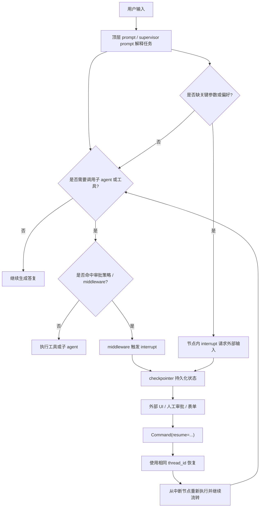

# LangChain 自研 Agent 的交互与中断设计

> 研究时间：2026-04-06
>
> 红色提示：本文基于当前 LangChain / LangGraph 官方文档整理。LangChain 系列框架演进很快，接口、默认行为、middleware 形态、streaming 语义和最佳实践都可能频繁变化，后续版本不保证仍然完全一致。

这份文档讨论的是：

- 如果你自己用 LangChain 写 agent
- 交互和中断应该怎么设计
- 提示词应该怎么分层
- 判断应该怎么从“模型想做什么”流转到“暂停、审批、补问、恢复”

这里默认采用当前 LangChain 官方文档背后的主流做法：

- 日常 agent 能力来自 LangChain agent / middleware
- 真正的暂停、恢复、持久化能力来自 LangGraph 的 `interrupt()`、checkpointer 和 `Command(resume=...)`

所以更准确地说，这份文档其实是在讲：

- 用 LangChain 做 agent 编排
- 用 LangGraph 做交互和中断控制

## 1. 最短结论

如果只记一句话：

- 在 LangChain 体系里，真交互和真中断不要只靠 prompt，要靠 `interrupt()`、checkpointer、`thread_id` 和 `Command(resume=...)`

再展开一点：

- `system_prompt` / 子 agent prompt 负责让模型更会问、更会停、更会解释
- `HumanInTheLoopMiddleware` 负责把工具调用审批变成标准化中断
- `interrupt()` 负责在任意节点显式暂停
- checkpointer 负责把状态保存下来
- `thread_id` 负责让你找到同一条执行线程
- `Command(resume=...)` 负责把人类决定或外部输入送回图里继续跑

这套模型最重要的价值是：

- 提示词负责行为策略
- 图运行时负责真实暂停与恢复

## 2. 它的控制方、运行载体、控制机制

按我们前面的统一术语，LangChain 这类自研方案最适合这样理解：

### 2.1 控制方

这里通常是：

- `self agent`
- 自研 agent

也就是：

- 你自己定义状态图
- 你自己定义 middleware
- 你自己决定哪些地方可中断
- 你自己决定 UI、审批面板、恢复方式

### 2.2 运行载体

常见载体包括：

- 后端服务
- Web 工作台
- 内部审批台
- CLI / TUI
- 你自己的 orchestrator

LangChain 不替你规定最终 UI 长什么样，所以载体能力很大程度上是你自己决定的。

### 2.3 控制机制

在 LangChain / LangGraph 里，最关键的交互与中断机制通常是：

- `system_prompt`
- 子 agent prompt
- tool description
- `HumanInTheLoopMiddleware`
- `interrupt()`
- checkpointer
- `thread_id`
- `Command(resume=...)`
- streaming updates

## 3. LangChain 体系里的中断到底是什么

这里要非常明确：

- LangChain 里的“真暂停”不是靠 prompt 自己实现
- 而是靠 LangGraph 的 interrupt 机制

官方文档里已经把这条链说得很清楚：

- `interrupt()` 可以在图节点任意位置暂停执行
- 暂停时图状态会通过 persistence layer 保存
- 恢复时通过 `Command(resume=...)` 把外部输入送回去
- 恢复必须使用同一个 `thread_id`

所以它的本质更像：

- 一个可持久化的图状态机
- 在某个节点显式抛出“现在等人”
- 等人给出回复后，再从同一执行线程继续

这和很多“让模型先问一句”的 prompt 方案有本质差别。

## 4. 交互和中断应该分成哪几类

如果你自己做 agent，最实用的分类通常是下面 4 种。

### 4.1 澄清型交互

场景：

- 用户目标不够明确
- 缺一个关键参数
- 缺业务偏好选择

这类交互最适合：

- 先用 prompt 约束 agent 不要乱猜
- 真需要暂停时，用 `interrupt()` 请求外部输入

### 4.2 审批型交互

场景：

- 发邮件
- 写文件
- 执行 SQL
- 调生产 API

这类交互最适合：

- 用 `HumanInTheLoopMiddleware`
- 在命中工具调用时自动进入 interrupt

### 4.3 评审 / 编辑型交互

场景：

- 让人改草稿
- 让人修订 tool args
- 让人替模型修正文案

这类交互最适合：

- 把当前内容放进 `interrupt()` 的 payload
- 人工返回编辑后的值
- 恢复后把这个值写回状态

### 4.4 调试 / 断点型中断

场景：

- 测试节点行为
- 单步检查图流转

这类中断最适合：

- `interrupt_before`
- `interrupt_after`

但官方文档也明确提醒：

- 静态断点更适合调试
- human-in-the-loop 工作流优先用动态 `interrupt()`

## 5. 提示词该怎么分层写

如果只给 LangChain 一个大 `system_prompt`，通常很快会乱。

更稳妥的做法是至少分成 4 层。

### 5.1 顶层 agent prompt

它负责：

- 角色定义
- 总目标
- 全局行为边界
- 什么时候该保守、什么时候该补问

这层建议写：

- 何时必须先问
- 哪类动作必须先审批
- 如果缺参数，不要自己编
- 收到拒绝后如何改道

### 5.2 子 agent prompt

如果你走 supervisor / sub-agent 模式，每个子 agent 都应该有自己的 domain prompt。

官方示例里已经是这个思路：

- calendar agent 有自己的 scheduling prompt
- email agent 有自己的 email prompt
- supervisor agent 只管高层路由和合成

这一层最重要的是：

- 子 agent 只负责自己域内判断
- 不要让 supervisor 直接懂所有低层 API 细节

### 5.3 tool description

这层经常被低估，但在 LangChain 里非常重要。

它负责告诉上层 agent：

- 什么时候该用这个工具
- 输入应该是什么
- 返回大概表示什么

如果 description 写得差，会直接影响：

- 路由判断
- 审批文案
- 人工 review 时的信息质量

### 5.4 中断 payload 文案

LangGraph 的 `interrupt()` 接收的是 JSON-serializable payload。

这意味着你不应该只丢一句：

- `\"approve?\"`

而更应该丢结构化内容，比如：

- `question`
- `details`
- `instruction`
- `action`
- `current_values`
- `allowed_decisions`

官方示例本身也是这个方向：

- 审批示例会传 `question` 和 `details`
- 编辑示例会传 `instruction` 和 `content`
- 工具审批 middleware 会传 `action_requests` 和 `review_configs`

所以对于 LangChain，自研交互文案最重要的一条经验是：

- 真正给人看的，不只是 prompt
- 还有 interrupt payload

## 6. 提示词文案骨架建议

这里给一个偏实战的骨架，不是固定模板，但很适合自研 agent 起步。

### 6.1 顶层 agent prompt 骨架

建议覆盖这几类句子：

- 角色句
  - 你是什么 agent，目标是什么
- 保守句
  - 信息不够时不要猜
- 交互句
  - 缺关键输入时先请求用户输入
- 审批句
  - 高风险动作执行前必须等待批准
- 恢复句
  - 被拒绝后优先解释原因并寻找安全替代方案

### 6.2 supervisor prompt 骨架

如果你有 supervisor，建议写：

- 只负责任务拆分和路由
- 优先调用高层能力，不要直接执行业务细节
- 收到子 agent 结果后整合成最终答复
- 涉及敏感动作时依赖中断 / middleware，而不是自己硬通过

### 6.3 子 agent prompt 骨架

建议写：

- 只处理本领域任务
- 把自然语言转成结构化调用
- 参数不确定时停下来补问
- 最终答复必须显式总结已执行内容

### 6.4 审批 payload 骨架

建议至少包含：

- `action`
- `question`
- `details`
- `current_args`
- `allowed_decisions`

### 6.5 编辑 payload 骨架

建议至少包含：

- `instruction`
- `content`
- `current_values`
- `constraints`

## 7. 判断如何流转

如果把 LangChain 自研 agent 的典型交互链抽象出来，最常见的是下面这条流：

这张图最关键的点有 4 个：

- prompt 决定“该不该问 / 该不该批”
- middleware 决定“哪些工具调用会自动进审批”
- interrupt 决定“系统现在真的暂停”
- checkpointer + `thread_id` 决定“系统之后还能继续”

## 8. LangChain 官方已经明确给出的关键约束

这是自研时最值得直接照着做的部分。

### 8.1 要有 checkpointer

官方文档反复强调：

- human-in-the-loop 需要 checkpointing
- 生产环境要用持久化 checkpointer

所以不要把中断设计成纯内存临时变量。

### 8.2 要有稳定的 `thread_id`

官方文档把 `thread_id` 直接当成 persistent cursor。

这意味着：

- 你的前端 / 工作台 / 会话系统必须自己管理 thread_id
- 否则恢复时根本找不回原来的执行线程

### 8.3 `interrupt()` 之前的副作用必须谨慎

官方文档明确提醒：

- interrupt 恢复时会从节点开头重新执行

所以：

- interrupt 前的副作用最好是幂等的
- 或者干脆把副作用拆到 interrupt 之后的单独节点

这条非常重要，很多自研 agent 就会死在这里。

### 8.4 多个 interrupt 的顺序必须稳定

官方文档明确提醒：

- 同一节点里多个 interrupt 的匹配是按顺序来的

所以不要：

- 条件性跳过某个 interrupt
- 用不稳定循环去动态生成 interrupt

否则恢复时很容易错位。

## 9. 什么时候该用 middleware，什么时候该手写 interrupt

一个务实判断：

### 9.1 优先用 middleware 的情况

适合：

- 工具调用审批
- 某些工具天然就是高风险动作
- 你想统一 approve / edit / reject 语义

原因：

- 官方已经把这条链封装得比较成熟
- 中断结构、决策类型、恢复方式更统一

### 9.2 直接手写 `interrupt()` 的情况

适合：

- 业务澄清问题
- 表单补全
- 草稿人工编辑
- 多阶段审阅

原因：

- 这类交互不一定是“工具审批”
- 但非常适合在图节点中显式暂停

### 9.3 两者混用的情况

这是最常见也最合理的设计：

- prompt 负责先别乱猜
- middleware 负责工具审批
- `interrupt()` 负责补问和审阅

## 10. 如果你自己写一个 LangChain Agent，我建议的最小架构

如果你只是想做一个靠谱的 v1，不要一上来过度设计。

最小可行方案通常是：

1. 一个顶层 agent
   - 带清晰的 system prompt
2. 一组边界清晰的工具
   - description 写清楚
3. 一个持久化 checkpointer
4. 一个稳定的 `thread_id`
5. 一层 `HumanInTheLoopMiddleware`
   - 拦高风险工具
6. 少量手写 `interrupt()` 节点
   - 处理补问和评审
7. 一个外部 UI / API 层
   - 负责显示 interrupt payload
   - 负责收集人工输入
   - 负责发 `Command(resume=...)`

这套结构已经足以支持：

- 工具审批
- 人工补问
- 编辑后继续
- 长会话恢复

## 11. 最终结论

如果你自己用 LangChain 写 agent，交互和中断最稳的做法不是：

- 只靠 prompt 写“请先问我”

而是：

- prompt 负责交互策略
- middleware 负责审批触发
- `interrupt()` 负责真暂停
- checkpointer 负责保存状态
- `thread_id` 负责找到同一执行线程
- `Command(resume=...)` 负责恢复执行

所以从架构上看，LangChain 自研 agent 最值得学的不是“某个提示词魔法句”，而是：

- 把提示词层和状态机层分开
- 把审批和补问分开
- 把暂停和恢复做成显式协议动作
