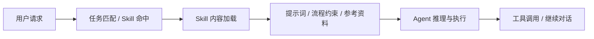

# Skill 对交互与中断的边界

> 研究时间：2026-04-06
>
> 红色提示：本文只描述当前阶段可见边界。后续产品、协议、客户端、skill 机制本身都可能变化，将来什么情况谁也不能打包票。

这份文档只讨论一个问题：

- `Skill` 现在对 agent 的交互与中断，究竟能做到什么程度
- 它和 `hooks`、`approval`、`request_user_input`、`turn/interrupt` 这类机制的边界在哪里

本文不讨论某个具体 skill 怎么写提示词，而是讨论 `Skill` 作为工具 / 机制的能力上限。

这里也先明确一个分析框架：

- `Skill` 不属于 agent 主体
- `Skill` 不属于产品载体
- `Skill` 属于控制 agent 的工具 / 机制

## 1. 最短结论

如果只记一句话：

- `Skill` 更像静态上下文注入和流程约束，不是运行时中断机制

再展开一点：

- 它可以明显影响 agent 下一步怎么想、怎么说、先不先问
- 它不能稳定保证 agent 在运行中“真停下来等人”
- 它不能天然接管工具调用审批
- 它不能天然中断已经在跑的 turn

所以，`Skill` 最适合做的是：

- 软引导
- 流程规范
- 任务分流
- 风险提醒

它不适合单独承担：

- 真暂停
- 真中断
- 真审批
- 真 supervisor 控制

## 2. 文档角度怎么理解 Skill

从当前 Codex 的技能体系与会话规则来看，`Skill` 的位置更接近：

- 一组预定义指令
- 一套任务方法论
- 一份上下文包
- 一个在特定任务命中时被加载的流程模块

也就是说，它解决的核心不是：

- 当前运行时怎么被外部打断

而是：

- 模型在开始做事前，应该带着什么额外规则和工作流

所以从文档语义上看，`Skill` 更像：

- developer prompt 的结构化复用
- 带工作步骤的提示模块
- 带参考资料、模板、脚本入口的上下文封装

而不像：

- hook
- approval gate
- user input channel
- turn control API

这是理解边界最关键的一步。

## 3. 源码角度怎么理解 Skill

从本地源码结构和当前会话机制去看，`Skill` 的设计思想也更靠近“加载上下文”，而不是“挂接运行时中断点”。

把它抽象看，大致是这样的：

这张图的重点不是流程本身，而是它暴露了一个事实：

- `Skill` 发生在推理前或推理边缘
- 它影响的是 agent 的“起跑姿势”
- 它不是一个运行时控制总线

如果从工程模块职责去理解，`Skill` 更像：

- 一层可复用任务规范
- 一层上下文拼装
- 一层方法论注入

而不是：

- 生命周期事件监听器
- 外部 supervisor 控制器
- 审批状态机
- 用户输入等待通道

## 4. Skill 现在能做到什么

这是 `Skill` 真正擅长的部分。

### 4.1 提高“先问再做”的概率

`Skill` 可以明确要求：

- 信息不足先提问
- 先读代码再写
- 先做风险检查
- 某些情况必须停下来确认

这会显著改变 agent 的行为倾向。

但要注意：

- 这是“提高概率”
- 不是“协议强制”

### 4.2 固化任务流程

`Skill` 很适合把某类任务固定成一套可重复执行的流程，比如：

- 先搜集上下文
- 再做判断
- 再改动
- 再校验

对于交互类任务，它能做的是：

- 强制 agent 优先暴露假设
- 强制 agent 先列选项
- 强制 agent 在高风险分支前提醒用户

这对“让 agent 看起来更像会停下来和人商量”很有效。

### 4.3 降低误操作概率

`Skill` 可以不断强调：

- 高风险操作先确认
- 不要直接执行破坏性命令
- 如果信息不够就不要推进

这种能力非常有用，但本质仍然是行为约束，不是底层闸门。

### 4.4 把外部材料和脚本接进流程

`Skill` 可以附带：

- 参考文档
- 模板
- 脚本入口
- 调研方法

因此它很适合做“交互前准备层”，比如：

- 先调用某个脚本生成上下文
- 再根据结果提示 agent 向用户提问

这能让 Skill 间接参与交互，但仍然不是 Skill 自己具备中断能力。

## 5. Skill 做不到什么

这是边界最容易被误判的部分。

### 5.1 不能保证真暂停

`Skill` 可以写：

- 遇到某类情况请先问我
- 碰到某关键词必须确认

但它不能保证系统一定进入：

- pending
- blocked on user input
- wait for structured answer

也就是说：

- 它可以要求“你应该问”
- 但不能提供“系统已经停住等回答”的硬保证

### 5.2 不能中断已在运行的 turn

当 agent 已经在跑，`Skill` 本身没有天然的：

- `interrupt`
- `cancel`
- `steer`
- `resume`

这种能力属于更高一级的控制面。

所以如果你的目标是：

- 外部脚本发现某个词就立刻打断当前 agent

那答案通常不是“把规则写进 Skill”，而是：

- 去用 hooks、approval、App Server 或外部 supervisor

### 5.3 不能替代审批机制

`Skill` 可以强调：

- 危险命令先确认
- 生产环境别乱动

但它不能像 approval policy 那样：

- 在动作执行前进入真实闸门
- 返回 accept / decline / cancel
- 让客户端以审批状态渲染界面

所以 Skill 不是 approval system 的替代物。

### 5.4 不能替代结构化用户输入机制

`Skill` 可以让 agent 更倾向于问问题，但它不能天然提供：

- 选项表单
- 结构化回答
- UI 级等待
- 回答后的协议续跑

这些能力更接近：

- `request_user_input`
- `MCP elicitation`

## 6. Skill 和其他机制的分工

最容易理解的方式，是把 Skill 放到整个控制栈里一起看：

| 机制 | 主要作用 | 是否真中断 | 是否真等待用户 | 典型定位 |
| --- | --- | --- | --- | --- |
| `Skill` | 上下文注入、流程约束 | 否 | 否 | 软引导 |
| `Hooks` | 生命周期守卫、拦截、续推 | 部分 | 否 | runtime guardrail |
| `Approval` | 动作前审批 | 部分 | 部分 | 人工闸门 |
| `request_user_input` | 结构化问答 | 是 | 是 | 真交互 |
| `MCP elicitation` | 外部服务驱动交互 | 是 | 是 | 真交互 |
| `turn/interrupt` | 中断当前 turn | 是 | 否 | 外部控制 |
| `turn/steer` | 改写当前 turn 方向 | 是 | 否 | 外部控制 |

这个表最重要的一点是：

- `Skill` 在控制栈里更靠前
- 它决定 agent 怎么起步
- 但不决定运行时如何被硬控制

## 7. Skill 最适合接什么 harness

如果你真的要用 Skill 去提升交互体验，最现实的做法不是“让 Skill 单挑中断”，而是让它承担前置策略层。

比较合理的组合是：

### 7.1 Skill + Hooks

适合：

- 想让 agent 默认更会先问
- 又想在关键动作前有硬拦截

分工：

- Skill 负责行为风格和流程偏好
- Hooks 负责运行时守门

### 7.2 Skill + Approval

适合：

- 想让 agent 语气上更会商量
- 同时关键动作必须真实确认

分工：

- Skill 负责“先提醒、先解释”
- Approval 负责“真挡住”

### 7.3 Skill + request_user_input / elicitation

适合：

- 想让 agent 更会提出好问题
- 又希望系统能真的等待结构化回复

分工：

- Skill 负责提问策略和问题质量
- `request_user_input` / elicitation 负责真暂停和真返回

### 7.4 Skill + App Server supervisor

适合：

- 你要自己做 IDE、工作台或 orchestrator
- 你希望 agent 在某些阶段表现得更像“先协商再推进”

分工：

- Skill 负责让 agent 默认采用你想要的交互风格
- App Server 负责真正的运行时控制

## 8. 一个务实判断

如果你的问题是：

> 我能不能只靠 Skill，让 agent 根据某些关键词自动停下来，等我交互？

一个相对准确的答案是：

- 可以让它“更倾向于停下来问”
- 但不能把这件事做成高可靠、系统级、可审计的真中断

如果你的问题是：

> Skill 在整套系统里最有价值的位置是什么？

答案是：

- 放在最前面，做策略层、流程层、提示层

它最擅长的是：

- 让 agent 更像你希望的合作方式

而不是：

- 直接变成运行时控制器

## 9. 最终结论

`Skill` 对交互和中断的价值很大，但价值不在“硬控制”，而在“软塑形”：

- 它能让 agent 更会先问
- 更会解释
- 更会暴露假设
- 更会在高风险前停一下

但它做不到把这些行为变成协议级保证。

所以今天最稳妥的定位仍然是：

- `Skill` 是交互策略层
- 不是中断控制层

如果你要的是真中断、真等待、真恢复，最终还是要落到：

- hooks
- approval
- `request_user_input`
- elicitation
- App Server / supervisor
