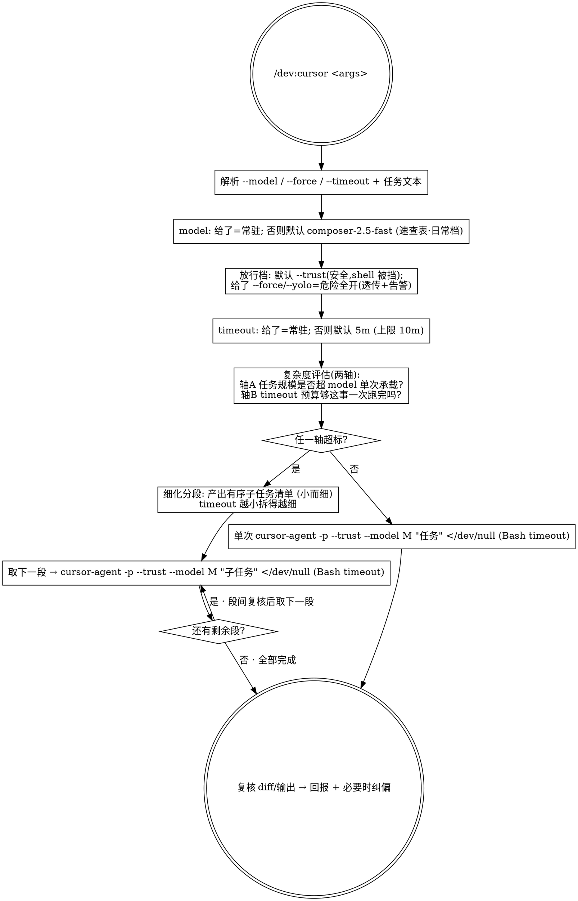

你是编排者，`cursor-agent` CLI 是执行者。把下面的任务**真正交接给 `cursor-agent -p` 起进程落地**，你只负责拼参数、起任务、复核结果——不要自己动手写这段代码。

原始参数：`$ARGUMENTS`

> 🪟 **二进制名（Windows/Git-Bash 坑，已实证）**：本文档统一写 `cursor-agent`。Windows + Git Bash 下裸名 `cursor-agent` **不解析**——安装目录虽在 PATH 里，但 Git Bash 不自动补 `.cmd` 扩展名，必须写 `cursor-agent.cmd`（mac/Linux 仍用无扩展的 `cursor-agent`）。下方所有命令按你的宿主选对应名字。

## 套餐速查表（推荐 model 组合）

> cursor-agent 把「推理档 / effort」**编进 model ID 本身**，没有 pi 那种独立的 `--thinking` 旋钮：后缀 `-low/-medium/-high/-xhigh/-max` 是推理档，中缀 `-thinking-` 开扩展思考，后缀 `-fast` 是**高速烧钱档**（更快更费额度，默认别用）。下表是钦定组合：**没给 `--model` 时默认走「日常」档**；想换档就显式 `--model` 原样覆盖。表目前只维护一行，后续能加档再加，不引入新 flag。

| 套餐 | `--model` | 何时用 |
|------|-----------|--------|
| **日常（默认）** | `composer-2.5-fast` | Cursor 自家编码模型、账号当前默认，快且省、专为 agent 编码调——绝大多数交接走它 |

需要别的模型时 `cursor-agent --list-models [关键词]` 现查现用，显式 `--model` 覆盖即可（如 `claude-sonnet-5`、`claude-opus-4-8-thinking-high`）；默认这一档已覆盖日常。

## 放行档（安全轴）—— 你只需在「默认安全」和「危险全开」之间选

> cursor-agent 有**两道闸**：①工作区信任 ②shell/编辑放行。默认档 `--trust` 已实证是**远比 `-f` 安全的自主档**——2026-07-04 实测坐实：`-p --trust` 下**代码编辑照常落地**，但 **shell 命令默认被挡**（未 allowlist 一律 `Rejected`）。所以纯改代码类交接根本不需要 `-f`。

| 放行档 | flag | 效果 | 何时用 |
|--------|------|------|--------|
| **默认·安全** | `--trust` | 代码编辑落地；**shell 命令被挡** | 纯改代码 / 重构 / 生成类交接（绝大多数） |
| **需要 shell·可控** | `--trust` + 目标 repo `.cursor/cli.json` 的 `permissions.allow` / `deny` | 白名单放行**具体**命令（`deny` 优先于 `allow`） | 要跑 build/test/git，但只放已知安全命令，如 `Shell(npm)`、`Shell(git)`；`deny` 掉 `Shell(rm)` 等 |
| **危险·全开** | `-f` / `--yolo` | "Force allow commands unless explicitly denied" —— shell 全放行 | 显式指定才用，命令里必须告警；不当默认 |

> `--auto-review`（服务端分类器自动跑安全调用、其余才问）**需要账号开通该特性 + classifier 模型 + team 权限**；个人账号不可用（会自动 fallback 到 allowlist）。**先不进默认**，有条件再显式加。

## 决策流程（严格按此点状图执行）



## 1. 解析参数

从 `$ARGUMENTS` 切出可选 flag，剩余非 flag 文本 = 任务描述：

- `--model <pattern>`：cursor-agent 模型 ID，支持方括号覆盖语法（如 `claude-opus-4-8[context=1m,effort=high]`）。
- `--force`（或 `--yolo`）：**危险全开**，shell 全放行。不给则默认走 `--trust` 安全档。
- `--timeout <值>`：接受 `5m` / `300s` / 纯毫秒数。
- 任务描述为空 → 停下，问用户要落地什么，别瞎跑。

## 2. 解析 model（显式给的=常驻固定值，原样透传）

- 给了 `--model` → 原样用，不二次猜测。若是模糊/部分名（如 `sonnet`），先 `cursor-agent --list-models <pattern>` 解析成精确 ID。
- 没给 → 默认 **「日常」档 `composer-2.5-fast`**（Cursor 自家编码模型、账号默认，见上方速查表）。固定 ID 直接用，**不需要每次 `--list-models`**；仅当该默认 ID 调用失配时才 `--list-models` 回退解析。
- 记下该 model 的能力档（context / 编码强度），第 5 步评估要用。

## 3. 解析放行档（默认安全，危险档需显式）

- 没给放行 flag → 默认 **`--trust`**：清工作区信任闸、让代码编辑自主落地，但 **shell 命令默认被挡**（安全）。纯改代码类交接就用它。
- 给了 `--force` / `--yolo` → **危险全开**，shell 全放行；原样透传，并在回报里**明确告警**这次是全放行档。
- 任务确实需要跑 shell（build/test/git）又不想全开 → 提示用户在目标 repo `.cursor/cli.json` 配 `permissions.allow`（白名单具体命令）+ `deny`（挡危险命令），仍配合 `--trust` 跑；`deny` 优先于 `allow`。

## 4. 解析 timeout（显式给的=常驻）

- 给了 `--timeout` → 解析成毫秒（`5m`→300000，`300s`→300000，纯数字→毫秒）。
- 没给 → 默认 `300000`（5 分钟）。
- 上限 `600000`（10 分钟，Bash 工具硬限）；超出则截断到 600000 并明确告警。
- 这个毫秒值就是后面所有 `cursor-agent -p` 调用传给 Bash 工具的 `timeout`。

## 5. 复杂度评估（两轴）—— 关键闸门

组装 cursor-agent 命令**之前**，评估任务是否超过「该 model 单次 + 该 timeout 预算」能干净做完的范围：

- **轴 A · 模型承载力**：任务的改动规模 / 涉及文件数 / 预计输出量，是否逼近或超过该 model 的 context / 单轮编码能力。
- **轴 B · timeout 预算**：估算这件事大概要跑多久。**timeout 给得越小，越说明需求要拆得细而小**——每一段必须能在该 timeout 预算内跑完。

判定：
- **两轴都在预算内** → 走第 6A 步「单次执行」。
- **任一轴超标** → 走第 6B 步「细化分段」。

## 6A. 单次执行

用 Bash 工具运行（`timeout` 设为第 4 步的毫秒值），任务文本做安全引用（含引号/换行时用单引号或 heredoc）。放行档按第 3 步：默认 `--trust`，危险档换成 `-f`：

```
cursor-agent -p --trust --model <M> "<任务描述>" </dev/null
```

> 🪟 Windows/Git-Bash 把 `cursor-agent` 换成 `cursor-agent.cmd`（见文首告警）。

> ⚠️ **`</dev/null` 作零成本护栏保留（本仓库实测「非必需」）**：`cursor-agent -p` 把 prompt 走参数、**不像 `pi -p` 那样死等 stdin EOF**——2026-07-04 实测：带与不带 `</dev/null` 都在 ~18s 正常返回，没有挂死。但社区曾报 print 模式在某些配置下挂死/不释放终端，故照 pi.md 惯例保留 `</dev/null` 兜底；它零成本、且已验证不影响正常返回。任务文本只走 `"<...>"` 参数或 heredoc，绝不靠 stdin 喂。

## 6B. 细化分段（超标时）

1. **由你**把需求拆成**有序的小子任务清单**（不是让 cursor-agent 列 TODO，是你拆）；timeout 越小、轴越超，拆得越细。
2. 逐段串行：对每个子任务组装 `cursor-agent -p --trust --model <M> "<子任务>" </dev/null`（放行档同第 3 步；`</dev/null` 护栏同 6A），各自用第 4 步的 timeout 跑。
3. **段间复核**：每段跑完后 `git diff` 看它实际改了什么，确认无误再取下一段；某段失败/超时就**停下回报现状，不盲目重试整坨**。

## 7. 复核与回报

不论单次还是分段，最后都：

- `git diff` / `git status` 看 cursor-agent 实际落地的改动。
- 向用户简报：用了哪个 model / 放行档（`--trust` 还是危险 `-f`）/ timeout、单次还是拆了几段、cursor-agent 改了什么、有没有需要纠偏的地方。
