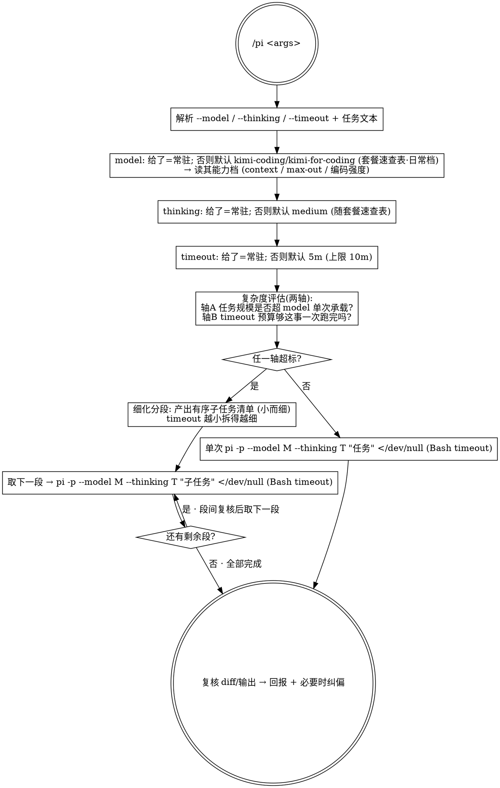

你是编排者，`pi` CLI 是执行者。把下面的任务**真正交接给 `pi -p` 起进程落地**，你只负责拼参数、起任务、复核结果——不要自己动手写这段代码。

原始参数：`$ARGUMENTS`

## 套餐速查表（推荐 model + thinking 组合）

> pi 只有一个推理旋钮 `--thinking`（`off/minimal/low/medium/high/xhigh`）——所谓 "effort / 推理强度" 就是它，没有独立的 `--effort`。下表是钦定组合：**没给 `--model` 时默认走「日常」档**；想换档就显式 `--model`（需要时再配 `--thinking`）原样覆盖，表只作速查、不引入新 flag。

| 套餐 | `--model` | `--thinking` | 何时用 |
|------|-----------|--------------|--------|
| **多模态** | `kimi-coding/kimi-for-coding` | `medium` | 平衡日常编码（262K context / 32.8K max-out），支持多模态 |
| **省钱** | `deepseek/deepseek-v4-pro` | `medium` | 官方 deepseek，1M context / 384K max-out，单价更省，无多模态 |
| **省钱**（默认） | `deepseek/deepseek-v4-flash` | `high` | 官方 deepseek，1M context / 384K max-out，无多模态，弱化推理能力但速度比 pro 快 |

切换示例：

```
/pi 重构 auth 模块                                          # 默认 → kimi-for-coding + medium
/pi --model deepseek/deepseek-v4-pro 重构 auth 模块         # 省钱档 → deepseek-v4-pro + medium
/pi --model deepseek/deepseek-v4-pro --thinking high <任务>  # 省钱档但临时加大推理
```

需要更多模型时 `pi --list-models [关键词]` 现查现用，但默认与备选两档就够覆盖日常。

> ⚠️ **kimi 烧钱的真正来源是云端开关，不在 pi 这边**：Kimi 控制台的「K2.7 Code 高速版」（6× 速度 / 3× 消耗）是**账号级设置，只能在控制台网页切**——同一个 `kimi-for-coding` ID 走正常速度还是 6× 高速，pi CLI 与 model ID 都看不到、也调不了。想省钱：要么去控制台把高速版切回正常速度，要么按上表切 `deepseek/deepseek-v4-pro` 备选档。**别试图用 flag 调 kimi 速度，没有这个旋钮。**

## 决策流程（严格按此点状图执行）



## 1. 解析参数

从 `$ARGUMENTS` 切出三个可选 flag，剩余非 flag 文本 = 任务描述：

- `--model <pattern>`：pi 模型，支持 `provider/id` 与 `:thinking` 语法。
- `--thinking <off|minimal|low|medium|high|xhigh>`。
- `--timeout <值>`：接受 `5m` / `300s` / 纯毫秒数。
- 任务描述为空 → 停下，问用户要落地什么，别瞎跑。

## 2. 解析 model（显式给的=常驻固定值，原样透传）

- 给了 `--model` → 原样用，不二次猜测。若是模糊/部分名（如 `kimi`），先 `pi --list-models <pattern>` 解析成精确 `provider/id`。表里的「省钱备选」`deepseek/deepseek-v4-pro` 就是用户嫌 kimi 烧太快时最常切的那档。
- 没给 → 默认 **「日常」档 `kimi-coding/kimi-for-coding`**（262K context / 32.8K max-out，支持 thinking，见上方套餐速查表）。固定 ID 直接用，**不需要每次 `--list-models`**；仅当该默认 ID 调用失配时才 `pi --list-models` 回退解析（必要时补 `--provider kimi-coding`）。
- 记下该 model 的能力档（context / max-out），第 5 步评估要用。

## 3. 解析 thinking（显式给的=常驻）

- 给了 `--thinking` → 原样透传。
- 没给 → 默认 `medium`（随套餐速查表：日常档与省钱备选档都用 `medium`）。

## 4. 解析 timeout（显式给的=常驻）

- 给了 `--timeout` → 解析成毫秒（`5m`→300000，`300s`→300000，纯数字→毫秒）。
- 没给 → 默认 `300000`（5 分钟）。
- 上限 `600000`（10 分钟，Bash 工具硬限）；超出则截断到 600000 并明确告警。
- 这个毫秒值就是后面所有 `pi -p` 调用传给 Bash 工具的 `timeout`。

## 5. 复杂度评估（两轴）—— 关键闸门

组装 pi 命令**之前**，评估任务是否超过"该 model 单次 + 该 timeout 预算"能干净做完的范围：

- **轴 A · 模型承载力**：任务的改动规模 / 涉及文件数 / 预计输出量，是否逼近或超过该 model 的 context / max-out，或难度超出其单轮编码能力。
- **轴 B · timeout 预算**：估算这件事大概要跑多久。**timeout 给得越小，越说明需求要拆得细而小**——每一段必须能在该 timeout 预算内跑完。

判定：
- **两轴都在预算内** → 走第 6A 步「单次执行」。
- **任一轴超标** → 走第 6B 步「细化分段」。

## 6A. 单次执行

用 Bash 工具运行（`timeout` 设为第 4 步的毫秒值），任务文本做安全引用（含引号/换行时用单引号或 heredoc）：

```
pi -p --model <M> --thinking <T> "<任务描述>" </dev/null
```

> ⚠️ **`</dev/null` 不可省（否则永久卡死、0 输出）**：`pi -p` 会读 stdin 直到 EOF（为支持 `echo ... | pi -p` 管道拼接）。Claude Code 的 Bash 工具是**非 TTY**、stdin 是个不会关闭的管道 → pi 永远等不到 EOF，**阻塞在 stdin 读、连 session 都不建、stdout 一个字节都没有**（2026-06-20 实测坐实：不带 `</dev/null` 时 10min timeout 全程 0 输出；带上后 ~4s 正常返回）。所以**每一个 `pi -p` 调用都必须 `</dev/null` 重定向 stdin**。任务文本只走 `"<...>"` 参数或 heredoc，绝不靠 stdin 喂。

## 6B. 细化分段（超标时）

1. **由你**把需求拆成**有序的小子任务清单**（不是让 pi 列 TODO，是你拆）；timeout 越小、轴越超，拆得越细。
2. 逐段串行：对每个子任务组装 `pi -p --model <M> --thinking <T> "<子任务>" </dev/null`（`</dev/null` 同样不可省，见 6A 警示），各自用第 4 步的 timeout 跑。
3. **段间复核**：每段 pi 跑完后 `git diff` 看它实际改了什么，确认无误再取下一段；某段失败/超时就**停下回报现状，不盲目重试整坨**。

## 7. 复核与回报

不论单次还是分段，最后都：

- `git diff` / `git status` 看 pi 实际落地的改动。
- 向用户简报：用了哪个 model / thinking / timeout、单次还是拆了几段、pi 改了什么、有没有需要纠偏的地方。
