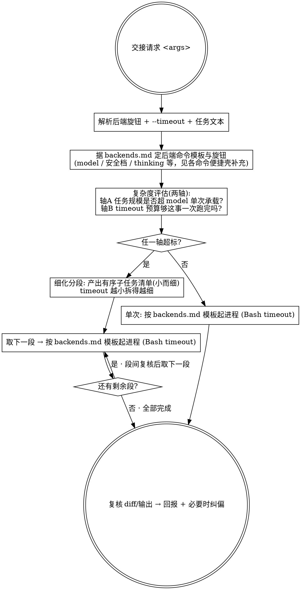

<!-- 本文件由 scripts/sync-handoff-core.mjs 从 skills-def/dev-run/references/ 镜像生成，请勿手改；改源后跑 `npm run sync:handoff-core`。 -->

# Orchestration — Tier-2 完整编排

> **本文件是「AI CLI 交接」编排流程的唯一事实源。** Tier-1 极简一发**不走本文件**（直接把任务压成一条命令跑、不拆段）。
> Tier-2 = 「复杂度自适应拆段 + 段间复核」，显式触发的完整交接编排走这里。
> 后端命令模板一律取自 [`backends.md`](./backends.md)，本文件只管「怎么把一次交接拆好、跑好、核好」。
> 它会被镜像进各宿主的分发形态（镜像件头部自带「请勿手改」注记）——**只改这一份**。

## 角色

你是**编排者**，选定后端的 CLI 是**执行者**：你只负责拼参数、起进程、段间复核、回报——**不要自己动手写这段代码**。

## 决策流程（严格按此点状图执行）

## 1. 参数解析

从参数里切出后端旋钮 + `--timeout` + 剩余非 flag 文本（= 任务描述）。旋钮按后端不同（pi 的 `--model`/`--thinking`、cursor 的 `--model`/`--force`、kimi 的 `--model`），细节见各命令便捷壳。

- `--timeout <值>`：接受 `5m` / `300s` / 纯毫秒数，解析成毫秒（`5m`→300000，`300s`→300000，纯数字→毫秒）。没给 → 默认 `300000`（5 分钟）。上限 `600000`（10 分钟，Bash 工具硬限），超出截断到 600000 并明确告警。这个毫秒值就是后面所有后端调用传给 Bash 工具的 `timeout`。
- 显式给的旋钮/timeout = 常驻固定值，原样透传，不二次猜测。
- **任务描述为空 → 停下，问用户要落地什么，别瞎跑。**

## 2. 复杂度评估（两轴）—— 关键闸门

组装后端命令**之前**，评估任务是否超过「该 model 单次 + 该 timeout 预算」能干净做完的范围：

- **轴 A · 模型承载力**：任务的改动规模 / 涉及文件数 / 预计输出量，是否逼近或超过该 model 的 context / max-out，或难度超出其单轮编码能力。
- **轴 B · timeout 预算**：估算这件事大概要跑多久。**timeout 给得越小，越说明需求要拆得细而小**——每一段必须能在该 timeout 预算内跑完。

判定：**两轴都在预算内** → 第 3 步「单次执行」；**任一轴超标** → 第 4 步「细化分段」。

## 3. 单次执行

按 [`backends.md`](./backends.md) 对应后端的命令模板起进程（含该后端的 stdin 护栏，如 pi/cursor 的 `</dev/null`），用 Bash 工具运行，`timeout` 设为第 1 步的毫秒值。任务文本按 backends.md「Shell 转义」做安全引用（含引号/换行时用单引号或 heredoc）。

## 4. 细化分段（超标时）

1. **由你**把需求拆成**有序的小子任务清单**（不是让后端 CLI 列 TODO，是你拆）；timeout 越小、轴越超，拆得越细。
2. 逐段串行：对每个子任务按 backends.md 模板组命令（stdin 护栏同第 3 步），各自用第 1 步的 timeout 跑。
3. **段间复核**：每段跑完后 `git diff` 看它实际改了什么，确认无误再取下一段；某段失败/超时就**停下回报现状，不盲目重试整坨**。

## 5. 复核与回报

不论单次还是分段，最后都：

- `git diff` / `git status` 看后端实际落地的改动。
- 向用户简报：用了哪个 backend / model / 档位（如 cursor 的 `--trust` 还是危险 `-f`）/ timeout、单次还是拆了几段、改了什么、有没有需要纠偏的地方。
